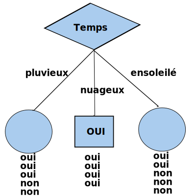
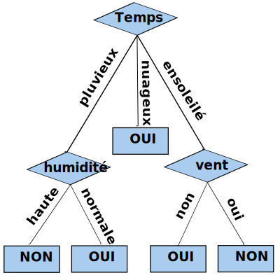
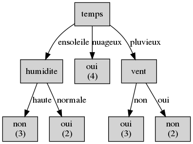
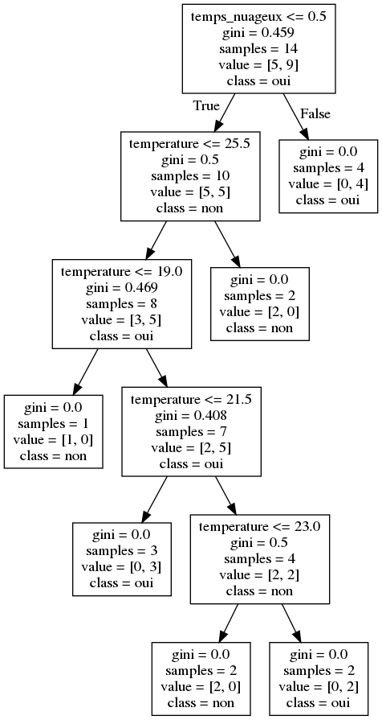

# Chapitre V: Arbre de décision

[vec-f]: https://latex.codecogs.com/png.latex?\overrightarrow{f}
[c-i]: https://latex.codecogs.com/png.latex?c_i
[S-j]: https://latex.codecogs.com/png.latex?S_j
[f-j]: https://latex.codecogs.com/png.latex?f_j


## Sommaire

[(Retour vers la page principale)](README.md)

- Chapitre IV: Arbre de décision
  - [IV-1 Description](#iv-1-description)
  - [IV-2 ID3](#iv-2-id3)
  - [IV-3 C4.5](#iv-3-c4.5)
  - [IV-4 CART](#iv-4-cart)
  - [IV-5 Avantages](#iv-5-avantages)
  - [IV-6 Limites](#iv-6-limites)
  - [IV-7 Un peu de programmation](#iv-7-un-peu-de-programmation)

## IV-1 Description

Un arbre de décision est un modèle très simple.
Etant donnée plusieurs caractéristiques, la décision se commence par un de ces caractéristiques; si ce n'ai pas suffisant, on utilise une autre, ainsi de suite.
Il est largement connu et utilisé dans de nombreuses entreprises pour faciliter le processus de prise de décision et l'analyse des risques.
Il a été largement utilisé dans les années 1960-1980 pour la construction de systèmes experts.
Les règles sont introduites manuellement, pour cette raison ce modèle a perdu sa popularité après les années 80.
L'apparition des méthodes mathématiques pour construire les arbres de décision fait revenir ce modèle à la bataille des algorithmes de l'apparentissage automatique.

Il existe plusieurs algorithmes automatiques pour construire les arbres de décision:


- **ID3** (Iterative Dichotomiser 3): dévelopé en 1986 par Ross Quinlan. Il peut être appliqué seulement sur les caractéristiques nominales. Il est utilisé pour le classement.
- **C4.5**: une extension de ID3 par Ross Quinlan. Il peut être appliqué sur tous les types de caractéristiques. Il est utilisé pour le classement.
- **C5.0**: une extension commerciale de C4.5, toujours par Ross Quinlan.
- **CART** (Classification and Regression Trees): comme C4.5 mais utilise d'autres métriques. Aussi, l'algorithme supporte la régression.

L'algorithme général de création d'un arbre de décision:


1. Déterminer la meilleure caractéristique dans l'ensemble de données d'entrainement.
1. Diviser les données d'entrainement en sous-ensembles contenant les valeurs possibles de la meilleure caractéristique.
1. Générez de manière récursive de nouveaux arbres de décision en utilisant les sous-ensembles de données créés.
1. Lorsqu'on ne peut plus classifier les données, on s'arrête.

[(Sommaire)](#sommaire)

## IV-2 ID3

L'algorithme ne fonctionne que sur des caractéristiques nominales.
Donc, si on a des caractéristiques continues, il faut appliquer la discritésation.
Aussi, il est utilisé pour le classement seulement.

### IV-2-1 Sélectionner la meilleure caractéristique

Cet algorithme utilise la fonction entropie et le gain d'information pour décider quelle est la meilleure caractéristique.
Etant donnée un ensemble de classes **C**, l'entropie de ensemble de donnée **S** est exprimée par:

![IV-2-entropy-s]

Où (en divivant le nombre des échantillons d'une certaine classe sur le nombre de tous les échantillons dans les données d'entrainement):

![IV-2-pci]

Etant donnée un vecteur de caractéristiques ![vec-f], en utilisant les valuers d'une caractéristique ![f-j], on peut diviser l'ensemble de donnée *S* en plusieurs sous ensembles groupés dans un ensemble ![S-j].
Le gain d'information est mesuré en se basant sur la différence entre l'entropie originale de *S* et celle après sa division en se basant sur une caractéristique ![f-j].

![IV-2-ig]

Où:

![IV-2-psjk]

La caractéristiques ayant plus de gain d'information est celle sélectionnée comme meilleure.
Aussi, la valeur avec entropie null est considérée comme feuille de l'arbre.

### IV-2-2 Exemple

On veut estimer une décision (jouer ou non) en se basant sur 4 caractéristiques: temps, température, humidité et vent.
On va construire un arbre de décision en se basant sur les données suivants:

| temps | température | humidité | vent | jouer |
| :---: | :---: | :---: | :---: | :---: |
| ensoleilé | chaude | haute | non | non |
| ensoleilé | chaude | haute | oui | non |
| nuageux | chaude | haute | non | oui |
| pluvieux | douce | haute | non | oui |
| pluvieux | fraîche | normale | non | oui |
| pluvieux | fraîche | normale | oui | non |
| nuageux | fraîche | normale | oui | oui |
| ensoleilé | douce | haute | non | non |
| ensoleilé | fraîche | normale | non | oui |
| pluvieux | douce | normale | non | oui |
| ensoleilé | douce | normale | oui | oui |
| nuageux | douce | haute | oui | oui |
| nuageux | chaude | normale | non | oui |
| pluvieux | douce | haute | oui | non |

On calcule la probabilité de chaque classe:


- P(jouer=oui) = 9/14
- P(jouer=non) = 5/14

On calcule, ensuite, l'entropie de l'ensemble des données:

H(S) = - P(jouer=oui) \* log2(P(jouer=oui)) - P(jouer=non) \* log2(P(jouer=non))

H(S) = - 9/14 \* log2(9/14) - 5/14 \* log2(9/14)

H(S) = 0.41 + 0.53 = 0.94

Pour chaque caractéristique, on calcule le gain d'information.

**temps:**

Le caractéristique "temps" divise les données sur 3 sous ensembles. Voici le nombre des occurrences de chaque classe dans chaque sous-ensemble:

| temps |  jouer (oui) | jouer (non) |
| :---: | :---: | :---: |
| ensoleilé | 2 | 3 |
| nuageux | 4 | 0 |
| pluvieux | 3 | 2 |

On calcule la probabilité de chaque ensemble:


- P(S_ensoleilé) = 5/14
- P(S_nuageux)  = 4/14
- P(S_pluvieux)  = 5/14

On calcule l'entropie de chaque ensemble:


- H(S_ensoleilé) = - 2/5 \* log2(2/5) - 3/5 \* log2(3/5) = 0.971
- P(S_nuageux) = - 4/4 \* log2(4/4) - 0/4 \* log2(0/4) = 0
- P(S_pluvieux) = - 3/5 \* log2(3/5) - 2/5 \* log2(2/5) = 0.971

Le gain d'information de la caractéristique "temps":

IG(S, temps) = H(S) - P(S_ensoleilé) \* H(S_ensoleilé) - P(S_nuageux) \* H(S_nuageux) - P(S_pluvieux) \* H(S_pluvieux)

IG(S, temps) = 0.94 - 5/14 \* 0.971 - 4/14 \* 0 - 5/14 \* 0.971

IG(S, temps) = 0.247

En calculant le gain d'information des autres caractéristiques

| | temps | température | humidité | vent |
| :---: | :---: | :---: | :---: | :---: |
| IG | 0.247 | 0.029 | 0.152 | 0.048 |

Donc, la première caractéristique à vérifier dans l'arbre sera "temps".
Comme l'entropie du temps étant "nuageux" est 0, cet ensemble contient des échantillons de la même classe.
Donc, cet ensemble forme une feuille.

|  |
|:--:|
| *Division des données selon la caractéristique "temps"* |

On fait la même chose sur les sous ensembles.

|  |
|:--:|
| *L'arbre de décision en utilisant ID3* |

[IV-2-entropy-s]: https://latex.codecogs.com/png.latex?H(S)=\sum\limits_{c_i\in{C}}-P(c_i)log_{2}P(c_i)
[IV-2-pci]: https://latex.codecogs.com/png.latex?P(c_i)=\frac{&#124;c_i&#124;}{&#124;S&#124;}
[IV-2-ig]: https://latex.codecogs.com/png.latex?IG(S,f_j)=H(S)-\sum\limits_{S_{jk}\in{S_j}}P(S_{jk})H(S_{jk})
[IV-2-psjk]: https://latex.codecogs.com/png.latex?P(S_{jk})=\frac{&#124;S_{jk}&#124;}{&#124;S&#124;}

[(Sommaire)](#sommaire)

## IV-3 C4.5

Cet algorithme est une amélioration sur l'algorithme ID3.
Parmi les améliorations:


- Transformer les caractéristiques continues (numériques) en caractéristiques nominales dynamiquement.
- Les caractéristiques sans valeurs sont ignorées lors du calcul de l'entropie et le gain d'information.
- Élagage des arbres après la création.

### IV-3-1 Sélectionner la meilleure caractéristique

Pour décider quelle est la meilleure caractéristique afin de diviser l'ensemble de données, C4.5 utilise une extension du gain d'information connue par **rapport de gain**.
Lorsqu'on a une caractéristique ait un grand nombre de valeurs, elle sera favorisée par le gain d'information.
Le rapport de gain fait face au problème de biais en normalisant le gain d'informations à l'aide de l'information de division.

Etant donnée:


- *C*: un ensemble de classes
- *S*: un ensemble de donnée d'entrainement
- ![vec-f]: un vecteur de caractéristiques
- ![S-j]: un hyper-ensemble contenant des ensembles avec les mêmes valeurs de la caractéristique ![f-j].
- *IG(S, ![f-j])*: le gain d'information en divisant l'ensemble de données *S* avec la caractéristique ![f-j].

L'information de dévision *SI* (Split Information) peut être calculée comme suit:

![IV-3-si]

Et le rapport de gain *GR* (Gain Ratio) est calculé comme suit:

![IV-3-gr]

Donc, la caractéristique avec le plus grand rapport de gain sera prise comme caractéristique de division.

### IV-3-2 Traitement des caractéristiques continues

ID3 ne supporte pas les caractéristiques avec des valeurs continues; comme l'age, le prix, etc.
C4.5 introduit le support de ce type de caractéristiques en cherchant le meilleur seuil qui peut diviser l'ensemble des valeurs d'une caractéristique en deux.

Afin de sélectionner la bonne division, on suit l'algorithme suivant à chaque fois qu'on veuille comparer une caractéristique avec d'autres:


- Pour chaque valeur *Vjk* d'une caractéristique ![f-j]
  - Diviser l'ensemble de données *S* en deux sous ensembles: les données avec ![f-j] > *Vjk* et celles avec ![f-j] <= *Vjk*
  - Calculer le rapport de gain *GR* de cet ensemble en le divisant avec un seuil *Vjk* sur la caractéristique ![f-j]
- La  valeur qui maximise le rapport de gain est prise comme seuil de dévision

### IV-3-3 Élagage des arbres (pruning)

Pour éviter le sur-apprentissage (créer un arbre avec une grande profondeur), on peut utiliser la technique d'élagage.
Il existe deux types d'élagage:


- pré-élagage: utiliser des critères d'arrêt de la division. Par exemmple: nombre minimum des échantillons dans un noeud, un taux d'homogénéité d'un sous-ensemble.
- post-élagage: construire l'arbre, ensuite éliminer les branches qui n'améliorent pas la performance de l'arbre.

Voici l'algorithme de post-élagage utilisé par C4.5:


- Construire l'arbre de décision
- Transformer l'arbre à un ensemble de règles de la forme (Si [preconditions] Alors [résultat]) en traversant l'arbre depuis la racine jusqu'à une feuile.
- Supprimer les préconditions qui n'améliorent pas la performance d'une règle.
- Arranger les règles élagées en se basant sur leurs performances. On commence par la règle qui donne plus de performance et on se termine par celle qui donne moins.


[IV-3-si]: https://latex.codecogs.com/png.latex?SI(S,f_j)=-\sum\limits_{S_{jk}\in{S_j}}\frac{&#124;S_{jk}&#124;}{&#124;S&#124;}*log_2(\frac{&#124;S_{jk}&#124;}{&#124;S&#124;})
[IV-3-gr]: https://latex.codecogs.com/png.latex?GR(S,f_j)=\frac{IG(S,f_j)}{SI(S,f_j)}

[(Sommaire)](#sommaire)

## IV-4 CART

L'algorithme CART est similaire à celui de C4.5 avec quelques différences:


- Il supporte la régression.
- Il utilise d'autres critères pour sélectionner la meilleure caractéristique.
Il essaye de minimiser une fonction de coût.
- Il utilise le pré-élagage en utilisant un critère d'arrêt.
- Il crée des arbres binaires (je ne sais pas comment il le fait avec des caractéristiques nominales ayant plusieurs valeurs).

### IV-4-1 Sélectionner la meilleure caractéristique

Dans le cas de CART, la meilleure caractéristique est celle qui minimize une fonction de coût *E(S)*.
Chaque caractéristique ![f-j] doit diviser un ensemble de données sur deux sous ensembles: gauche (*Sg*) et droit (*Sd*).
Donc, celle avec la plus petite valeur de l'Indice de diversité sera choisie.

![IV-4-idg]

Dans le cas de classement, CART utilise l'indexe de diversité Gini pour mesurer l'erreur de classification.
Etant donnée un ensemble de classes *C*, la fonction Gini Index de l'ensemble de donnée *S* est exprimée par:

![IV-4-gini]

Où (en divivant le nombre des échantillons d'une certaine classe sur le nombre de tous les échantillons dans les données d'entrainement):

![IV-2-pci]

Dans le cas de régression, on utilise la somme des carrés résiduelle.
Etant donné un ensemble de données *S*, la somme des carrés résiduelle est calculée par:

![IV-4-rss]

Où *yi* sont les valeurs attendues, et

![IV-4-ym]

est la valeur de sortie estimée.

### IV-4-2 Élagage des arbres (pruning)

CART utilise le pré-élagage qu'on le réfère par la condition d'arrêt.
Le critère le plus utilisé pour arréter la division est le nombre minimal des échantillons dans un noeud.
Si on atteint ce nombre, on ne divise plus et on considère le noeud comme feuille avec la classe dominante comme classe de sortie en cas de classement, ou la moyenne des sorties en cas de régression.

Aussi, on peut appliquer un post-élagage.
La méthode la plus simple est de supprimer une feuille et de tester la performane sur des données de validation.
Tant qu'il n'y a pas une chute de performance, on continue l'opération.


[IV-4-idg]: https://latex.codecogs.com/png.latex?ID(S,f_j)=\frac{&#124;S_G&#124;}{&#124;S&#124;}*E(S_G)+\frac{&#124;S_D&#124;}{&#124;S&#124;}*E(S_D)
[IV-4-gini]: https://latex.codecogs.com/png.latex?E(S)=\sum\limits_{c_i\in{C}}P(c_i)(1-P(c_i))=1-\sum\limits_{c_i\in{C}}P^2(c_i)
[IV-4-rss]: https://latex.codecogs.com/png.latex?E(S)=\frac{1}{&#124;S&#124;}\sum\limits_{i=1}^{i=&#124;S&#124;}(y_i-\overline{y})^2
[IV-4-ym]: https://latex.codecogs.com/png.latex?\overline{y}=\frac{1}{&#124;S&#124;}\sum\limits_{i=1}^{i=&#124;S&#124;}y_i

[(Sommaire)](#sommaire)

## IV-5 Avantages

Parmi les avantages des arbres de décision:
- Ils sont simples à comprendre et à interpréter. On peut visualiser les arbres. Aussi, on peut expliquer les résulats oubtenus facilement.
- Ils peuvent travailler sur des données avec peu de préparation. Par exemple, ils n'ont pas besoin de la normalisation des données.
- Ils acceptent les données numériques et nominales. Les autres algorithmes d'apprentissage sont spécialisés dans un seul type de données.
- Ils donnent de bonne performance même si leurs hypothèses sont un peu violées par le modèle réel à partir duquel les données ont été générées.

[(Sommaire)](#sommaire)

## IV-6 Limites

Parmi les avantages des arbres de décision:
- Ils peuvent être aussi complexes, ils ne généralisent pas bien (overfitting: surapprentissage). On peut régler ça en fixant le nombre minimum des échantillons dans les feuilles ou en fixant la profondeur maximale de l'arbre.
- Ils peuvent être unstable à cause des variations des données.
- Ils existe des conceptes qui sont un peu difficile à apprendre par les arbres de décision. Ils ne sont pas faciles à exprimer, par exemple: XOR.
- Ils peuvent être biaisés à la classe dominante. Donc, il faut balancer les données avant d'entrainer le système.
- Ce n'ai pas garanti de tomber sur l'arbre de décision optimal.

[(Sommaire)](#sommaire)

## IV-7 Un peu de programmation

Il existe des outils pour construire des arbres de décision.
Dans ce démo, on utilise toujours [Scikit-learn](https://scikit-learn.org/stable/):
- Langage: python.
- Algorithmes: CART.
- Type de classification: classement et régression.
- Limites: ne supporte pas les caractéristiques nominales.
- Visualisation: oui (en utilisant [Graphviz](https://www.graphviz.org)).

Concernant ID3, on peut construire un module (comme l'algorithme est simple), ou on peut chercher des modules sur internet; par exemple [decision-tree-id3](https://github.com/svaante/decision-tree-id3).

## IV-7-1 Le classement (ID3)

On va reprendre l'exemple précédent: décider de jouer en se basant sur des caractéristiques nominales. Consulter le fichier [data/jouer0.csv](data/jouer0.csv)

| temps | temperature | humidite | vent | jouer |
| :---: | :---: | :---: | :---: | :---: |
| ensoleile | chaude | haute | non | non |
| ensoleile | chaude | haute | oui | non |
| nuageux | chaude | haute | non | oui |
| pluvieux | douce | haute | non | oui |
| pluvieux | fraiche | normale | non | oui |
| pluvieux | fraiche | normale | oui | non |
| nuageux | fraiche | normale | oui | oui |
| ensoleile | douce | haute | non | non |
| ensoleile | fraiche | normale | non | oui |
| pluvieux | douce | normale | non | oui |
| ensoleile | douce | normale | oui | oui |
| nuageux | douce | haute | oui | oui |
| nuageux | chaude | normale | non | oui |
| pluvieux | douce | haute | oui | non |

Les données sont sauvegardées sous format CSV ([data/jouer0.csv](data/jouer0.csv)).
On va utiliser **pandas** pour lire le fichier.

```python
import pandas
#lire le fichier csv
data = pandas.read_csv("../../data/jouer0.csv")
```

On sépare les données en: entrées (les caractéristiques) et sorties (les classes: comestible ou toxique).
Dans ce fichier, les classes (qui sont le résultat attendu) sont dans la dernière colonne, et les autres caractéristiques (les entrées) sont dans les colonnes restantes.

```python
# séparer les données en: entrées et sorties
X = data.iloc[:,:-1] #les caractéristiques
y = data.iloc[:,-1]  #les résulats (classes)
```

On va utiliser un outil sur Github: [https://github.com/svaante/decision-tree-id3](https://github.com/svaante/decision-tree-id3).
On a modifié ce programme pour qu'il accepte les caractéristiques comme chaînes de caractères (string).
Le code modifié est fourni avec ce tutorial: [codes/arbre/](codes/arbre/).


```python
# importer l'estimateur
from id3a import Id3Estimator
# créer un estimateur
estimator = Id3Estimator()
# entrainer l'estimateur
estimator.fit(X, y)
```

On peut exporter l'arbre sous forme Graphviz.

```python
from id3a import export_graphviz
# expoter l'arbre sous format graphviz
export_graphviz(estimator.tree_, "resultat.dot", data.columns.tolist())
```

On peut visualiser ce fichier en utilisant [Graphviz](https://www.graphviz.org).
Il faut l'installer sur machine.
Aussi, on peut exporter ce fichier vers une image PNG.

```sh
dot -Tpng resultat.dot -o resultat.png
```

Le résulat sera:



Si vous voulez implémenter cet algorithme de zéro, voici quelques outils que vous pouviez utiliser:
-  [scipy.stats.entropy](https://docs.scipy.org/doc/scipy/reference/generated/scipy.stats.entropy.html#scipy.stats.entropy)


## IV-7-2 Le classement (CART)

Reprenant l'exemple précédent avec une petite modéfication: on utilise des caractéristiques continues.

| temps | température | humidité | vent | jouer |
| :---: | :---: | :---: | :---: | :---: |
| ensoleilé | 30 | 85 | non | non |
| ensoleilé | 27 | 90 | oui | non |
| nuageux | 28 | 78 | non | oui |
| pluvieux | 21 | 96 | non | oui |
| pluvieux | 20 | 80 | non | oui |
| pluvieux | 18 | 70 | oui | non |
| nuageux | 18 | 65 | oui | oui |
| ensoleilé | 22 | 95 | non | non |
| ensoleilé | 21 | 70 | non | oui |
| pluvieux | 24 | 80 | non | oui |
| ensoleilé | 24 | 70 | oui | oui |
| nuageux | 22 | 90 | oui | oui |
| nuageux | 27 | 75 | non | oui |
| pluvieux | 22 | 80 | oui | non |

Consulter le fichier [data/jouer.csv](data/jouer.csv).

On commence toujours par la lecture du fichier en utilisant **pandas**.
Et, bien sûre, séparer les données d'entrée et la sortie.

```python
import pandas

#lire le fichier csv
data = pandas.read_csv("../../data/jouer.csv")

# séparer les données en: entrées et sorties
X = data.iloc[:,:-1] #les caractéristiques
y = data.iloc[:,-1]  #les résulats (classes)

```

Pour construire un arbre de classement, on va utiliser [sklearn.tree.DecisionTreeClassifier](scikit-learn.org/stable/modules/generated/sklearn.tree.DecisionTreeClassifier.html).
L'outil ne supporte pas les caractéristiques nominales: "temps" et "vent" dans notre cas.
Dans ce cas, on va les encoder comme des caractéristiques numériques.
Il existe une bibliothèque pour encoder les caractéristiques nominales comme numériques.
Vous pouvez consulter [https://github.com/scikit-learn-contrib/categorical-encoding](https://github.com/scikit-learn-contrib/categorical-encoding).

### IV-7-2-1 Encodage One Hot (Pandas)

On va utiliser l'encodage **One Hot** fourni par [pandas.get_dummies](https://pandas.pydata.org/pandas-docs/stable/reference/api/pandas.get_dummies.html).

```python
X_dum = pandas.get_dummies(X)

# imprimer les premières lignes des données
print X_dum.head()
```

Lorsqu'on imprime les données avec les nouvelles colonnes, ça va nous donner:

```
           temperature  humidite  temps_ensoleile  temps_nuageux  temps_pluvieux  vent_non  vent_oui
0           30        85                1              0               0         1         0
1           27        90                1              0               0         0         1
2           28        78                0              1               0         1         0
3           21        96                0              0               1         1         0
4           20        80                0              0               1         1         0

```

On utilise le classifieur fourni par **Scikit-learn**.

```python
from sklearn.tree import DecisionTreeClassifier

# créer un estimateur
estimator = DecisionTreeClassifier()
# entrainer l'estimateur
estimator.fit(X_dum, y)
```

On peut exporter l'arbre sous forme Graphviz en utilisant la fonction [sklearn.tree.export_graphviz](https://scikit-learn.org/stable/modules/generated/sklearn.tree.export_graphviz.html).
Ici, on va donner comme paramètres: le classifieur, le fichier de sortie, les noms des colonnes et les noms des classes.

```python
from sklearn.tree import export_graphviz

# expoter l'arbre sous format graphviz
export_graphviz(estimator,
    out_file="arbre_cart0.dot",
    feature_names = X_dum.columns,
    class_names=estimator.classes_)
```

On peut visualiser ce fichier en utilisant [Graphviz](https://www.graphviz.org).
Il faut l'installer sur machine.
Aussi, on peut exporter ce fichier vers une image PNG.

```sh
dot -Tpng arbre_cart0.dot -o arbre_cart0.png
```

Le résulat sera:



### IV-7-2-2 Encodage DictVectorizer (Scikit-learn)

On va utiliser [sklearn.feature_extraction.DictVectorizer](https://scikit-learn.org/stable/modules/generated/sklearn.feature_extraction.DictVectorizer.html).
On transforme les données stockées sous forme d'un **DataFrame**  vers une liste des dictionnaires (tableaux associatifs).
Cette structure peut, ensuite, être transformée en  utilisant **DictVectorizer**.
Enfin, on transforme la structure résultante vers un **DataFrame**.

```python
from sklearn.feature_extraction import DictVectorizer

# Transformer X à une liste de dicts
list_dicts = X.T.to_dict().values()
# créer une instance du transformateur
vec = DictVectorizer()
# transformer
new_list_dicts = vec.fit_transform(list_dicts).toarray()
# créer un nouveau DataFrame
X_vec = pandas.DataFrame(new_list_dicts, columns=vec.get_feature_names())

# imprimer les premières lignes des données
print X_vec.head()
```

L'opération donne le même résulatat que **pandas.get_dummies**.

```
       humidite  temperature  temps=ensoleile  temps=nuageux  temps=pluvieux  vent=non  vent=oui
0      85.0         30.0              1.0            0.0             0.0       1.0       0.0
1      90.0         27.0              1.0            0.0             0.0       0.0       1.0
2      78.0         28.0              0.0            1.0             0.0       1.0       0.0
3      96.0         21.0              0.0            0.0             1.0       1.0       0.0
4      80.0         20.0              0.0            0.0             1.0       1.0       0.0
```

Le reste est le même qu'avant.

## IV-7-3 La régression (CART)

Pour la régression, on utilise [sklearn.tree.DecisionTreeRegressor](https://scikit-learn.org/stable/modules/generated/sklearn.tree.DecisionTreeRegressor.html) de la même façon.
La seule chose différente est que les résulats *y* sont numériques.


[(Sommaire)](#sommaire)

## Bibliographie

- https://becominghuman.ai/decision-trees-in-machine-learning-f362b296594a
- https://towardsdatascience.com/a-guide-to-decision-trees-for-machine-learning-and-data-science-fe2607241956
- https://towardsdatascience.com/decision-trees-in-machine-learning-641b9c4e8052
- https://medium.com/deep-math-machine-learning-ai/chapter-4-decision-trees-algorithms-b93975f7a1f1
- https://medium.com/coinmonks/what-is-entropy-and-why-information-gain-is-matter-4e85d46d2f01
- https://scikit-learn.org/stable/modules/tree.html
- https://sefiks.com/2017/11/20/a-step-by-step-id3-decision-tree-example/
- https://sefiks.com/2018/05/13/a-step-by-step-c4-5-decision-tree-example/
- https://machinelearningmastery.com/classification-and-regression-trees-for-machine-learning/
- https://medium.com/machine-learning-guy/an-introduction-to-decision-tree-learning-id3-algorithm-54c74eb2ad55
- https://www.datacamp.com/community/tutorials/decision-tree-classification-python
- https://pdfs.semanticscholar.org/2b3c/17da5e60d5bc953c181ca637bf6262469d25.pdf
