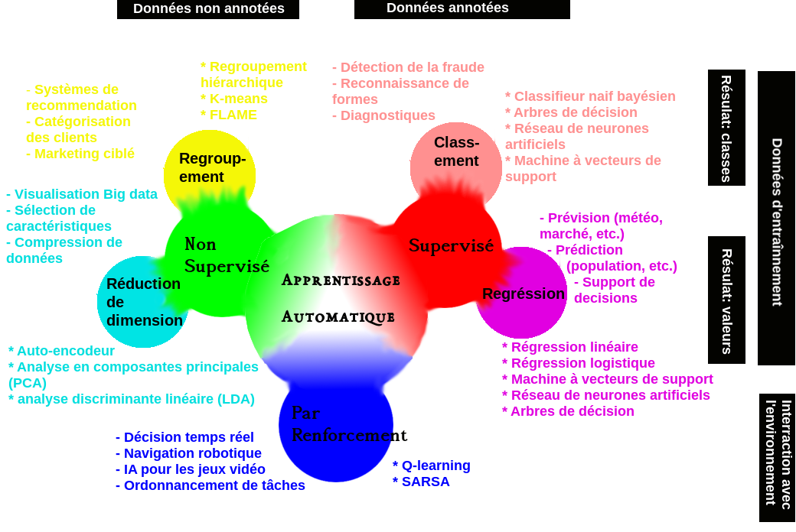
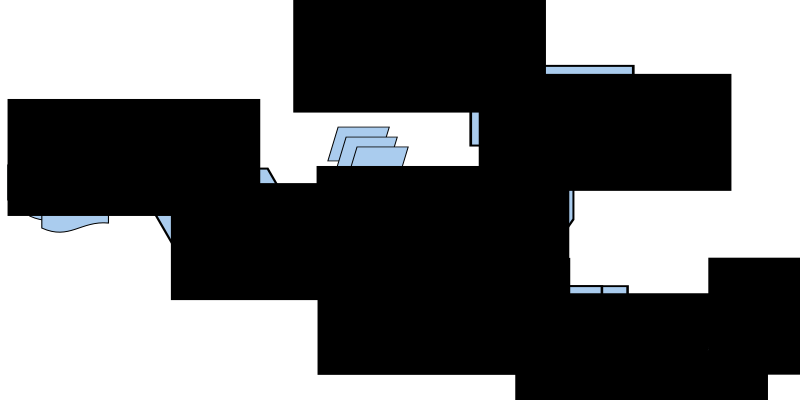
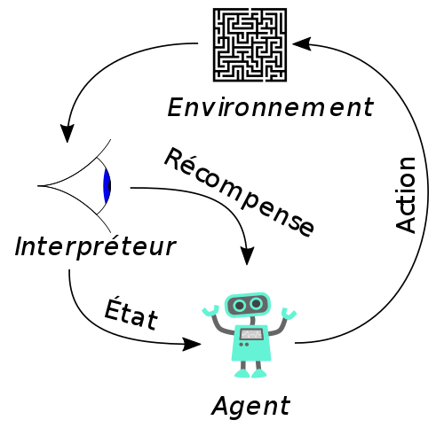

# Chapitre I: Introduction

## Sommaire

[(Retour vers la page principale)](README.md)

- Chapitre I: Introduction
  - [I-1 Motivation](#i-1-motivation)
  - [I-2 Applications](#i-2-applications)
  - [I-3 Types des algorithmes d'apprentissage](#i-3-types-des-algorithmes-dapprentissage)
  - [I-4 Limites de l'apprentissage automatique](#i-4-limites-de-lapprentissage-automatique)
  - [I-5 Outils de l'apprentissage automatique](#i-5-outils-de-lapprentissage-automatique)
  - [I-6 Méthodologies de science des données](#i-6-méthodologies-de-science-des-données)
  - [I-7 Un peu de programmation](#i-7-un-peu-de-programmation)

|  |
|:--:|
| *Apprentissage automatique* |

## I-1 Motivation

- Certaines tâches sont difficiles à programmer manuellement: Reconnaissance de formes, Traduction par machine, Reconnaissance de la parole, Aide à la décision, etc.
- Les données sont disponibles, qui peuvent être utilisé pour estimer la fonction de notre tâche.

[(Sommaire)](#sommaire)

## I-2 Applications

- Santé:
  - Watson santé de IBM: https://www.ibm.com/watson/health/
  - Projet Hanover de Microsoft: https://hanover.azurewebsites.net
  - DeepMind santé de Google: https://deepmind.com/applied/deepmind-health/

- Finance : Prévention de fraude, management de risques, prédiction des investissements, etc.
- Domaine légal : cas de CaseText https://casetext.com
- Traduction: Google translate https://translate.google.com/
**_...TODO: Add more_**

[(Sommaire)](#sommaire)

## I-3 Types des algorithmes d'apprentissage

### I-3-1 Apprentissage supervisé

Lorsqu'on se dispose d'un ensemble de données avec les résultats attendus, on peut entrainer un système sur ces données pour inférer la fonction utilisée pour avoir ces résultats.
En résumé:

- **Source d'apprentissage:** des données annotées (nous avons les résultats attendus)
- **Retour d'information:** direct; à partir des résultats attendues.
- **Fonction:** prédire les future résultats

Etant donné un ensemble de données annotées (avec les résultats attendues):
1. On divise cet ensemble en 2 parties: données d'entrainement et données de test (évaluation).
On peut avoir les données de validation comme troisième partie.
1. On fait entrainer notre système sur les données d'apprentissage pour avoir un modèle
1. Si on utilise des données de validation, on teste la performance de notre modèle.
Si la performance dépasse un certain seuil, on passe vers l'étape suivante.
Sinon, on change les paramètres de l'algorithme d'apprentissage ou on on récupère plus de données d'entrainement, et on refaire l'étape précédente.
1. On utilise les données de test (évaluation) afin de décider la performance du modèle et le comparer avec un système de base.
Si on n'a pas utilisé des données de validation, on peut faire l'étape précédente ici.
Mais, il faut faire attention: si on valide plusieurs fois sur les données de test, le système va être adapté aux données de test.
Or, l'intérêt des données de test est d'évaluer le modèle sur des nouvelles données qu'il n'a pas rencontré.


| |
|:--:|
| *Apprentissage supervisé* |


Selon le type d'annotation, on peut remarquer deux types des algorithmes d'apprentissage automatique: classement et régression.

#### A) Classement (Classification supervisée)

Lorsque le résultat attendu est une classe (groupe).

| Par exemple: |
| :--: |
| Classer un animal comme: chat, chien, vache ou autre en se basant sur le poids, la longueur et le type de nourriture.  |

Supposant, on veut évaluer un système de classification des courriers indésirables: indésirable ou non.
Un résulat obtenu par un un système de classification binaire peut être:
- **Vrai positif** (True positive): Le modèle prédit correctement la classe positive. Le modèle prédit correctement qu'un message est indésirable.
- **Vrai négatif** (True negative): Le modèle prédit correctement la classe négative. Le modèle prédit correctement qu'un message est désirable.
- **Faux positif** (False positive): Le modèle prédit incorrectement la classe positive. Le modèle prédit incorrectement qu'un message est indésirable.
- **Faux négatif** (False negative): Le modèle prédit incorrectement la classe négative. Le modèle prédit incorrectement qu'un message est désirable.

La [matrice de confusion](https://fr.wikipedia.org/wiki/Matrice_de_confusion) d'un système de classification binaire est:

| |  classe réelle positive | classe réelle négative |
| :---: | :---: | :---: |
| classe prédite positive | vrai positif (VP)  | faux positif (FP)  |
| classe prédite négative | faux négatif (FN)  | vrai négtif (VN)  |


##### Justesse

La justesse d'un modèle de classification est la proportion de ces prédictions correctes. C'est le nombre des prédictions correctes divisé par le nombre total des prédictions.
En terme de classification binaire et en utilisant les 4 types des résulats, on peut l'écrire sous forme:

![I-3-just]

La justesse seule n'ai pas suffisante comme mesure de performance, surtout pour les ensembles de données avec des classes imbalancées.
Revenant au système de classification des courriels.

Supposant qu'on a 20 données de test: 3 indésirables et 17 désirables. Le modèle qu'on a entrainé a pu détecter toutes les 17 classes désirables et seulement 1 classe indésirable.

|  | indésirable (réel) | désirable (réel) | Total (prédit) |
| :---: | :---: | :---: | :---: |
| indésirable (modèle) | 1 | 1 | 2 |
| désirable (modèle) | 2 | 16 | 18 |
| Total (réel) | 3 | 17 |  |

Dans ce cas, la justesse est (1 + 16)/20 = 85%.
Le problème est que ce modèle puisse bien détecter les couriers désirables contrairement aux courriers indésirables.
Or, notre but est de détecter les courrier indésirables afin de les filtrer.

##### Précision

La précision est la proportion des prédictions positives correctes par rapport aux prédictions postives (correctes ou non).

![I-3-p]

La précision de notre modèle précédent est 1/(1 + 1) = 50%.
En d'autre termes, parmi les prédictions qu'il puisse prédire correctement, les couriers indésirables forment 50%.

##### Rappel

Le rappel est la proportion des prédictions positives correctes par rapport aux prédictions correctes (négatives et positives).

![I-3-r]

Le rapperl de notre modèle précédent est 1/(1 + 2) = 33%.
En d'autre termes, il peut prédire seulement 33% des couriers indésirables.

##### F1 mesure

C'est la moyenne harmonique entre le rappel et la précision.

![I-3-f1]

Le F1 mesure de notre modèle précédent est (2 \* 50 \* 33)/(50 + 33) = 3300/83 = 40 %.

##### La corrélation de matthews

C'est un coéfficient pour mesurer de qualité en tenant compte des données imbalancées.
Cette mesure est connue, aussi, sous le nom: coefficient Phi.
Un modèle peut avoir des coefficients allant de -1 jusqu'à +1:
- -1: les prédictions sont totalement irronnées.
- 0: la performance du modèle est comparable avec un système aléatoire (random).
- 1: les prédictions sont parfaites.

Pour un système de classification binaire, sa formule exprimé en terme de la matrice de confusion est:

![I-3-matthews]

Le CCM de notre modèle précédent est (1 \* 16 - 1 \* 2)/rac((1 + 1)(1 + 2)(16 + 1)(16 + 2)) = 14/rac(2 \* 3 \* 17 \* 18) = 14/rac(1836) = 0.33.
En d'autre termes, la qualité de notre modèle est un peu plus que le système aléatoire, mais reste toujours mauvaise.

##### Cas multi-classes

Supposant, on a entrainer un modèle pour détecter à partir d'une image donnée s'il s'agit d'un chat, un chien ou une vache.
Dans le cas de la justesse, c'est le nombre des classes correctement détectées divisé par le nombre des examples.
Mais, comment calculer la précision et le rappel?

Ces deux métriques sont calculés par rapport une classe donnée. Le rappel (précision) du modèle est la moyenne arithmétique des rappels (précisions) de toutes les classes.

Supposant les données de test sont 60 examples uniformément distribuées sur les classes (20 par classe).
Voici la matrice de confusion:

|  | chat (réel) | chien (réel) | vache (réel) | Total (prédit) |
| :---: | :---: | :---: | :---: | :---: |
| chat(modèle) | 10 | 5 | 0 | 15 |
| chien(modèle) | 8 | 13 | 3 | 24 |
| vache(modèle) | 2 | 2 | 17 | 21 |
| Total (réel) | 20 | 20 | 20 | |

La justesse est (10 + 13 + 17)/60 = 67%.

Le rappel de la classe "chat" est 10/20 = 50%. Donc, on peut confirmer que notre modèle peut détecter 50% des "chat" de l'ensemble de données.

La précision de la classe "chat" est 10/15 = 67%. Donc, on peut confirmer que 67% des données marquées comme "chat" par notre modèle sont réelement de la classe "chat".

De la même façon:

Rappel(chien) = 13/20 = 65%.

Précision(chien) = 13/24 = 54%

Rappel(vache) = 17/20 = 85%

Précision(vache) = 17/21 = 81%

Rappel = (50 + 65 + 85)/3 = 67%

Précision = (67 + 54 + 81)/3 = 67%


[I-3-matthews]: https://latex.codecogs.com/png.latex?CCM=\frac{VP*VN-FP*FN}{\sqrt{(VP+FP)(VP+FN)(VN+FP)(VN+FN)}}
[I-3-f1]: https://latex.codecogs.com/png.latex?F1=\frac{1}{\frac{1}{P}+\frac{1}{R}}=2*\frac{P*R}{P+R}
[I-3-r]: https://latex.codecogs.com/png.latex?P=\frac{VP}{VP+VN}
[I-3-p]: https://latex.codecogs.com/png.latex?P=\frac{VP}{VP+FP}
[I-3-just]: https://latex.codecogs.com/png.latex?Justesse=\frac{VP+VN}{VP+VN+FP+FN}


#### B) Régression

Lorsque le résultat attendu est une valeur.

| Par exemple: |
| :--: |
| Estimer le prix d'une maison à partir de sa surface, nombre de chambre et l'emplacement. |


### I-3-2 Apprentissage non supervisé

Lorsque nous disposons d'un ensemble de données non annotées (sans savoir les résulats attendus).
En résumé:

- **Source d'apprentissage:** des données non annotées
- **Retour d'information:** pas de retour; on dispose seulement des données en entrée.
- **Fonction:** rechercher les structures cachées dans les données.

Selon le type de structure que l'algorithme va découvrir, on peut avoir: le regroupement et la réduction de dimension.

#### A) Clustering (Regroupement)

L'algorithme de regroupement sert à assigner les échantillons similaires dans le même groupe.
Donc, le résultat est un ensemble de groupes contenants les échantillons.

| Par exemple: |
| :--: |
| Regrouper les plantes similaires en se basant sur la couleur, la taille, etc.  |

#### B) Réduction de dimension

L'algorithme de réduction de dimension a comme but d'apprendre comment représenter des données en entrée avec moins de valeurs.

| Par exemple: |
| :--: |
| Représenter des individus sur un graphe de deux dimensions en utilisant la taille, le poids, l'age, la couleur des cheveux, la texture des cheveux et la couleur des yeux  |


### I-3-3 Apprentissage par renforcement

- **Source d'apprentissage:** le processus de décision
- **Retour d'information:** un système de récompense
- **Fonction:** recherche des structures cachées dans les données.

|  |
|:--:|
| *Apprentissage par renforcement [ [Wikimedia](https://commons.wikimedia.org/wiki/File:Reinforcement_learning_diagram_fr.svg?uselang=fr) ]* |


[(Sommaire)](#sommaire)

## I-4 Limites de l'apprentissage automatique

- Pour des tâches complexes, on a besoin d'une grande quantité de données
- Dans le cas de l'apprentissage supervisé, l'annotation de données est une tâche fastidieuse; qui prend beaucoup de temps.
- Le traitement automatique de langages naturels (TALN) reste un défit
- Les données d'entrainement sont souvent biaisées

[(Sommaire)](#sommaire)

## I-5 Outils de l'apprentissage automatique

### I-5-1 frameworks et bibliothèques de programmation

#### Deep Learning

Les outils suivants sont conçus pour l'apprentissage approfondi qui est basé le réseau de neurones.
- Outil: nom et lien de l'outil (ordre alphabétique)
- Licence: la licence de l'outil. Ici, on ne s'intéresse que par les outils open sources.
- écrit en: le langage de programmation utilisé pour écrire cet outil.
- interfaces: les langages de programmation qu'on puisse utiliser pour utiliser cet outil (API).

| Outil | Licence | écrit en | interfaces |
| :---: | :---: | :---: | :---: |
| [Caffe](http://caffe.berkeleyvision.org) | BSD | C++ | C++, MATLAB, Python |
| [Deeplearning4j](https://deeplearning4j.org) | Apache 2.0 | C++, Java | Java, Scala, Clojure, Python, Kotlin |
| [Keras](https://keras.io) | MIT | Python | Python, R |
| [Microsoft Cognitive Toolkit](https://www.microsoft.com/en-us/cognitive-toolkit/) | MIT | C++ | Python, C++ |
| [MXNet (Apache)](https://mxnet.apache.org) | Apache 2.0 | C++ | C++, Clojure, Java, Julia, Perl, Python, R, Scala |
| [TensorFlow](https://www.tensorflow.org) | Apache 2.0 | C++, Python | Python (Keras), C/C++, Java, Go, JavaScript, R, Julia, Swift |
| [Theano](http://deeplearning.net/software/theano/) | BSD | Python | Python |
| [Torch](http://torch.ch) | BSD | C, Lua | C, Lua, LuaJIT |

Pour une comparaison plus détaillée, veuillez consulter [cette page en Wikipédia](https://en.wikipedia.org/wiki/Comparison_of_deep_learning_software)

#### Générique

La liste suivante contient les outils avec plusieurs algorithmes d'apprentissage automatique.

| Outil | Licence | écrit en | interfaces |
| :---: | :---: | :---: | :---: |
| [Data Analytics Acceleration Library(Intel)](http://software.intel.com/intel-daal) | Apache 2.0 | C++, Python, Java | C++, Python, Java |
| [Encog](https://www.heatonresearch.com/encog/) |  | C#, Java | C#, Java |
|[Java Statistical Analysis Tool (JSAT)](https://github.com/EdwardRaff/JSAT)| GPL 3 | Java | Java |
| [MLLib(Apache Spark)](http://spark.apache.org/mllib/) | Apache 2.0 | - | Java, R, Python, Scala |
| [ScalaNLP Breeze](https://github.com/scalanlp/breeze) | Apache 2.0 | Scala | Scala |
| [Scikit-learn](https://scikit-learn.org/stable/) | BSD | Python | Python |
| [Shogun](http://www.shogun-toolbox.org) | - | C++ | C++, C#, Java, Lua, Octave, Python, R, Ruby |


### I-5-2 Logiciels

Ce sont des logiciels visuels qui peuvent être utilisés par des non informaticiens.

- [Weka](https://www.cs.waikato.ac.nz/ml/weka/): écrit en java. 
- [Orange3](https://orange.biolab.si): écrit en python.

### I-5-3 Apprentissage automatique comme un service

Apprentissage automatique comme un service (MLaaS: Machine Learning as a Service):
- [Amazon Machine Learning](https://aws.amazon.com/aml/)
- [BigML](https://bigml.com)
- [DataRobot](https://www.datarobot.com)
- [Deepai enterprise machine learning](https://deepai.org/enterprise-machine-learning)
- [Deepcognition](https://deepcognition.ai)
- [FloydHub](https://www.floydhub.com)
- [IBM Watson Machine Learning](https://www.ibm.com/cloud/machine-learning)
- [Google Cloud Machine Learning Engine](https://cloud.google.com/ml-engine/)
- [Microsoft Azure Machine Learning studio](https://azure.microsoft.com/fr-fr/services/machine-learning-studio/)
- [MLJAR](https://mljar.com)
- [Open ML](https://www.openml.org)
- [ParallelDots](https://www.paralleldots.com)
- [VALOHAI](https://valohai.com)
- [Vize](https://vize.ai): Traitement d'images

### I-5-3 Les ressources

#### Répertoires de données

- [Kaggle](https://www.kaggle.com): télécarger les données, faire des compétitions avec des prix.
- [Registry of Open Data on AWS](https://registry.opendata.aws)
- [UC Irvine Machine Learning Repository](https://archive.ics.uci.edu/ml/index.php)
- [Visual data](https://www.visualdata.io): Des données sur le traitement d'images.

#### Images

- [COCO](http://cocodataset.org/#home) un ensemble de données de détection, de segmentation et d'annotation des images.
- [COIL-100](http://www1.cs.columbia.edu/CAVE/software/softlib/coil-100.php) des images de 100 objets différents prises sous tous les angles dans une rotation de 360.
- [ImageNet](http://image-net.org) des images organisées selon la hiérarchie de  [WordNet](http://wordnet.princeton.edu/)
- [Indoor Scene Recognition](http://web.mit.edu/torralba/www/indoor.html) reconnaissance de scènes d'intérieur
- [Labelled Faces in the Wild](http://vis-www.cs.umass.edu/lfw/): reconnaissance faciale sans contraintes
- [LabelMe](http://labelme.csail.mit.edu/Release3.0/browserTools/php/dataset.php) Images annotées
- [LSUN](http://lsun.cs.princeton.edu/2016/) des images concernant un défi pour la classification de la scène.
- [Open Images Dataset de Google](https://ai.googleblog.com/2016/09/introducing-open-images-dataset.html)
- [Stanford Dogs Dataset](http://vision.stanford.edu/aditya86/ImageNetDogs/) la reconnaissance des races de chiens.
- [VisualGenome](http://visualgenome.org) une base pour connecter les images au langage

#### Analyse des sentiments

- [Large Movie Review Dataset](http://ai.stanford.edu/~amaas/data/sentiment/) critiques des films
-[Multi-Domain Sentiment Dataset](http://www.cs.jhu.edu/~mdredze/datasets/sentiment/) commentaires sur les produits d'Amazon
- [Sentiment140](http://help.sentiment140.com/for-students/) des Tweets avec des émoticônes filtrées.
- [Stanford Sentiment Treebank](https://nlp.stanford.edu/sentiment/index.html) critiques de films

#### Traitement du langage naturel

- [Amazon Reviews](https://snap.stanford.edu/data/web-Amazon.html)
- [Enron Email Dataset](https://www.cs.cmu.edu/~./enron/)
- [Google Books Ngrams](https://aws.amazon.com/datasets/google-books-ngrams/)
- [Gutenberg eBooks List](http://www.gutenberg.org/wiki/Gutenberg:Offline_Catalogs) Liste annotée de livres électroniques du projet Gutenberg.
- [Hansards text chunks of Canadian Parliament](https://www.isi.edu/natural-language/download/hansard/) texte aligné: Français-Anglais
- [HotspotQA Dataset](https://hotpotqa.github.io) Question-Réponse (réponse automatique)
- [Jeopardy](https://www.reddit.com/r/datasets/comments/1uyd0t/200000_jeopardy_questions_in_a_json_file/) Les questions de Jeopardy format Json
- [SMS Spam Collection in English](http://www.dt.fee.unicamp.br/~tiago/smsspamcollection/)
- [UCI's Spambase](https://archive.ics.uci.edu/ml/datasets/Spambase) filtrage du courrier électronique indésirable
- [Wikipedia Links data](https://code.google.com/archive/p/wiki-links/downloads)
- [Yelp Reviews](https://www.yelp.com/dataset)

#### Auto-conduite

- [Baidu Apolloscapes](http://apolloscape.auto/)
- [Berkeley DeepDrive BDD100k](http://bdd-data.berkeley.edu/)
- [Bosch Small Traffic Lights Dataset](https://hci.iwr.uni-heidelberg.de/node/6132)
- [Cityscapes dataset](https://www.cityscapes-dataset.com/)
- [Comma.ai](https://archive.org/details/comma-dataset)
- [CSSAD Dataset](http://aplicaciones.cimat.mx/Personal/jbhayet/ccsad-dataset)
- [KUL Belgium Traffic Sign Dataset](http://www.vision.ee.ethz.ch/~timofter/traffic_signs/)
- [LaRa Traffic Light Recognition](http://www.lara.prd.fr/benchmarks/trafficlightsrecognition)
- [LISA datasets](http://cvrr.ucsd.edu/LISA/datasets.html)
- [MIT AGE Lab](http://lexfridman.com/automated-synchronization-of-driving-data-video-audio-telemetry-accelerometer/)
- [Oxford's Robotic Car](http://robotcar-dataset.robots.ox.ac.uk/)
- [WPI datasets](http://computing.wpi.edu/dataset.html)

[(Sommaire)](#sommaire)

## I-6 Méthodologies de science des données

### CRISP-DM (Cross-industry standard process for data mining) [Standard ouvert]

|  |
|:--:|
| *CRISP-DM [ [Wikimedia](https://commons.wikimedia.org/wiki/File:CRISP-DM_Process_Diagram.png) ]* |

### ASUM-DM (Analytics Solutions Unified Method for Data Mining) [IBM]

|  |
|:--:|
| *ASUM-DM [ [Source](ftp://ftp.software.ibm.com/software/data/sw-library/services/ASUM.pdf) ]* |

### TDSP (Team Data Science Process) [Microsoft]

|  |
|:--:|
| *TDSP [ [Source](https://docs.microsoft.com/fr-fr/azure/machine-learning/team-data-science-process/overview) ]* |

[(Sommaire)](#sommaire)

## I-7 Un peu de programmation

### Evaluation du classement

Ici, on va utiliser l'outil **scikit-learn** pour l'évaluation.
On va créer une liste des résulats attendus et une autre qu'on suppose être la liste des résulatats générés par notre modèle.

#### Exemple 1: classement binaire

Consulter le fichier [codes/eval/classer1.py](codes/eval/classer1.py)

On a entrainé un modèle pour classer les emails comme indésirables ou non.
Ensuite, on a testé ce modèle avec 20 examples qui a donné la matrice de confusion suivante:

|  | indésirable (réel) | désirable (réel) | Total (prédit) |
| :---: | :---: | :---: | :---: |
| indésirable (modèle) | 1 | 1 | 2 |
| désirable (modèle) | 2 | 16 | 18 |
| Total (réel) | 3 | 17 |  |

On annote les courniers indésirables avec 1 et ceux désirables avec 0.
Dans la classification binaire de **scikit-learn**, la classe positive est annotée par 1 par défaut.
Cela peut être changé en utilisant l'option **pos_label**.
La fonction **str** est juste pour transformer un nombre vers une chaîne de charactères.

```python
#imortation des fonctions nécessaires
from sklearn.metrics import accuracy_score, precision_score
from sklearn.metrics import recall_score, f1_score, matthews_corrcoef

# créer une liste de 3 "1" suivis de 17 "0"
reel = [1] * 3 + [0] * 17
# créer une list [1, 0, 0, 1] concaténée avec 16 "0"
predit = [1, 0, 0, 1] + [0] * 16

print "La justesse: " + str(accuracy_score(reel, predit))
print "La précision: " + str(precision_score(reel, predit))
print "Le rappel: " + str(recall_score(reel, predit))
print "La mesure F1: " + str(f1_score(reel, predit))
print "corrélation de matthews: " + str(matthews_corrcoef(reel, predit))
```

**scikit-learn** offre la possibilié de récupérer la matrice de confusion

```python
#imortation des fonctions nécessaires
from sklearn.metrics import confusion_matrix
# récupérer et afficher la matrice de confusion
mat_conf = confusion_matrix(reel, predit)
print mat_conf
# récupérer le nombre des VN, FP, FN, TP
vn, fp, fn, vp = mat_conf.ravel()
print vn, fp, fn, vp
```

Ceci va afficher:

```
[[16  1]
 [ 2  1]]
16 1 2 1
```

On peut, aussi, récupérer un rapport de classification.

```python
from sklearn.metrics import classification_report
noms_classes = ["desirable", "indesirable"]
print(classification_report(reel, predit, target_names=noms_classes))
```

Ceci va afficher:

```
                precision   recall   f1-score   support

desirable       0.89        0.94      0.91        17
indesirable     0.50        0.33      0.40         3

micro avg       0.85        0.85      0.85        20
macro avg       0.69        0.64      0.66        20
weighted avg    0.83        0.85      0.84        20
```

#### Exemple 2: classement multi-classes

Consulter le fichier [codes/eval/classer2.py](codes/eval/classer2.py)

Reprenons l'exemple des classification des animaux en chat, chien ou vache.
Supposant notre test a donné la matrice de confusion suivante:

|  | chat (réel) | chien (réel) | vache (réel) | Total (prédit) |
| :---: | :---: | :---: | :---: | :---: |
| chat(modèle) | 10 | 5 | 0 | 15 |
| chien(modèle) | 8 | 13 | 3 | 24 |
| vache(modèle) | 2 | 2 | 17 | 21 |
| Total (réel) | 20 | 20 | 20 | |

On crée les deux listes:
- reel: la liste des résulats attendus avec 60 éléments
- predit: la liste des résultats générés par le système

On attribut à chaque classe un numéro: chat(0), chien(1) et vache(2)

```python
# 20 chats, 20 chiens et 20 vaches
reel = [0] * 20 + [1] * 20 + [2] * 20
# les 20 chats sont prédites comme 10 chats, 8 chiens et 2 vaches
predit = [0] * 10 + [1] * 8 + [2] * 2
# les 20 chiens sont prédites comme 5 chats, 13 chiens et 2 vaches
predit += [0] * 5 + [1] * 13 + [2] * 2
# les 20 vaches sont prédites comme 0 chats, 3 chiens et 17 vaches
predit += [1] * 3 + [2] * 17
```

La justesse est calculée comme dans la clasification binaire

```python
print "La justesse: ", accuracy_score(reel, predit)
```

La présion, le rappel et le f1-score dans le cas muti-classes peuvent être calculés selons plusieurs méthodes, celle qu'on décrit précédement s'appelle "macro"

```python
print "La précision: ", precision_score(reel, predit, average="macro")
print "Le rappel: " , recall_score(reel, predit, average="macro")
print "La mesure F1: " , f1_score(reel, predit, average="macro")
```

On peut sélectionner les classes qu'on veut prendre en considération. Supposant, on veut calculer la précision pour les classes: chat et chien et ignorer la classe vache.
On peut, même, ajouter des classes qui ne sont pas présentes dans les données de test.

```python
print "La précision (chat, chien): ", precision_score(reel, predit, labels=[0, 1], average="macro")
```

[(Sommaire)](#sommaire)

## Bibliographie

- https://www.kdnuggets.com/2017/11/3-different-types-machine-learning.html
- https://www.techleer.com/articles/203-machine-learning-algorithm-backbone-of-emerging-technologies/
- https://www.wired.com/story/greedy-brittle-opaque-and-shallow-the-downsides-to-deep-learning/
- https://data-flair.training/blogs/advantages-and-disadvantages-of-machine-learning/
- https://towardsdatascience.com/coding-deep-learning-for-beginners-types-of-machine-learning-b9e651e1ed9d
- https://towardsdatascience.com/selecting-the-best-machine-learning-algorithm-for-your-regression-problem-20c330bad4ef
- https://docs.microsoft.com/fr-fr/azure/machine-learning/team-data-science-process/overview
- https://www.ibm.com/support/knowledgecenter/en/SSEPGG_9.5.0/com.ibm.im.easy.doc/c_dm_process.html
- ftp://public.dhe.ibm.com/software/analytics/spss/documentation/modeler/18.0/en/ModelerCRISPDM.pdf
- https://medium.com/datadriveninvestor/the-50-best-public-datasets-for-machine-learning-d80e9f030279
- https://developers.google.com/machine-learning/crash-course/prereqs-and-prework?hl=fr
- https://towardsdatascience.com/supervised-machine-learning-classification-5e685fe18a6d
- http://text-analytics101.rxnlp.com/2014/10/computing-precision-and-recall-for.html
- https://scikit-learn.org/stable/modules/generated/sklearn.metrics.matthews_corrcoef.html
- https://en.wikipedia.org/wiki/Matthews_correlation_coefficient
