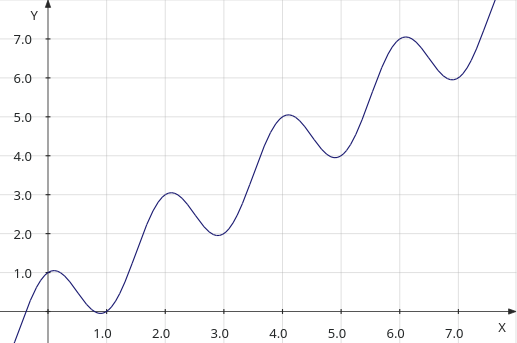
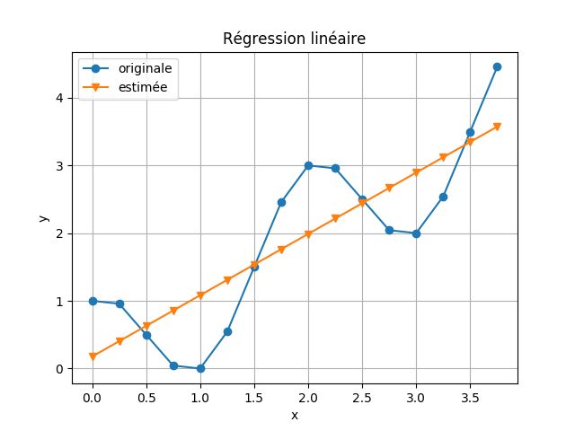
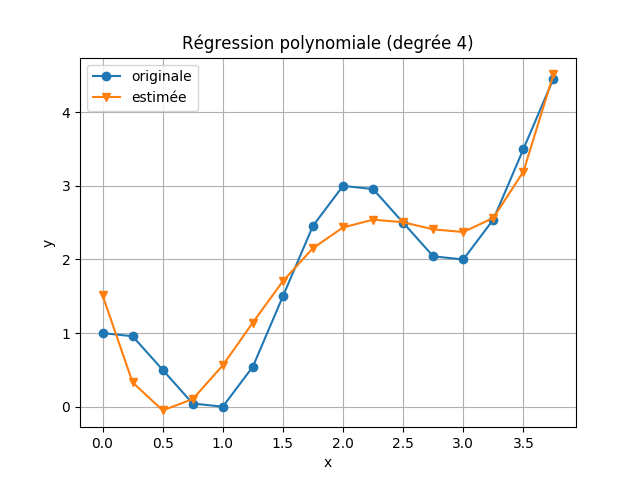
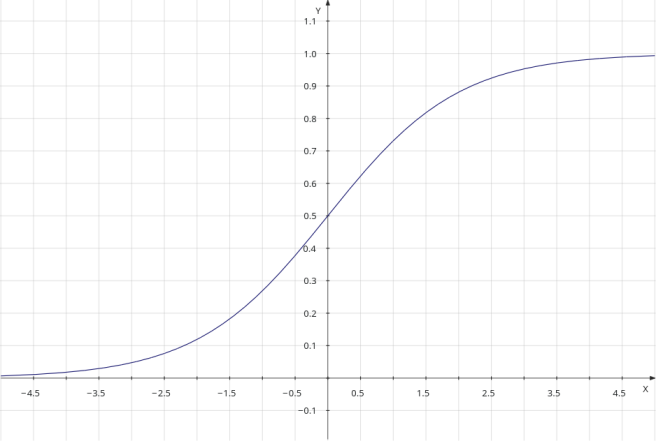
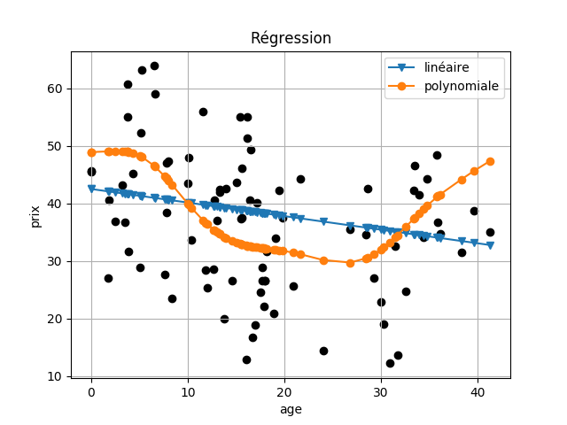

# Chapitre V: Régression

## Sommaire

[(Retour vers la page principale)](README.md)

- Chapitre V: Régression
  - [V-1 Motivation](#v-1-motivation)
  - [V-2 Régression linéaire](#v-2-régression-linéaire)
  - [V-3 Régression polynomiale](#v-3-régression-polynomiale)
  - [V-4 Régression logistique](#v-4-régression-logistique)
  - [V-5 Avantages](#v-5-avantages)
  - [V-6 Limites](#v-6-limites)
  - [V-7 Un peu de programmation](#v-7-un-peu-de-programmation)

## V-1 Motivation

La régression sert à trouver la relation d'une variable par rapport à une ou plusieurs autres.

Dans l'apprentissage automatique, le but de la régression est d'estimer une valeur (numérique) de sortie à partir des valeurs d'un ensemble de caractéristiques en entrée.
Par exemple, estimer le prix d'une maison en se basant sur sa surface, nombre des étages, son emplacement, etc.
Donc, le problème revient à estimer une fonction de calcul en se basant sur des données d'entrainement.

![V-1-fct]

Il existe plusieurs algorithmes pour la régression:
- Régression linéaire
- Régression polynomiale
- Régression logistique
- Régression quantile
- etc.


[V-1-fct]: https://latex.codecogs.com/png.latex?\hat{y}(x)=f(x_1,x_2,...,x_m)

[(Sommaire)](#sommaire)

## V-2 Régression linéaire

La régression linéaire simple sert à trouver unne relation d'une variable de sortie (continue) par rapport à une autre.

![V-2-lineare0]

Ici, on va présenter la régression linéaire multiple, qui est une version étendue de la régression linéaire simple.
Etant donnée que cette version est très simple et on aime torturer ceux qui lisent cette petite introduction.
Aussi, savoir comment la version généralisée se fonctionne est plus intéressant.

### V-2-1 Principe

La régression linéaire multiple a comme but de décrire la variation d'une variable dépendante (*y*) associée aux variations de plusieurs variables indépendantes.
Dans le contexte de l'apparentissage automatique, elle sert à estimer une fonction linéaire entre la sortie (avec des valeurs continues, numériques) et les entrées.
La fonction qui éstime les valeurs de *y* d'un échantillon en se basant sur des caractéristiques d'entrée *x* est écrite comme suit:

![V-2-lineare]

Où:

- *ŷ* est la sortie éstimée (résulat),
- *xj* est une caractéristique d'entrée,
- *θj* est le poids de cette caractéristique

Dans ce cas, l'apprentissage est le fait d'estimer ces poids en se basant sur des données d'entrées et des résulats attendus.

### V-2-2 La fonction du coût

La fonction du coût aide à trouver l'erreur entre le résulat estimé et le résultat attendu.
Elle est utilisée pour régler les poids des caractéristiques.
Donc, pour trouver les poids les plus optimals, il faut minimiser cette fonction.

Etant donnée un ensemble des données d'entrainement avec *N* échantillons, la fonction du coût la plus utilisée est l'erreur quadratique moyenne (MSE) entre les sorties attendues (*y*) et les sorties estimées (*ŷ*)

![V-2-mse]

Cette fonction est une fonction convexe; ça veut dire qu'elle n'a pas des minimums locaux.
Donc, elle a un minimum global unique.


### V-2-3 Algorithme du gradient

L'algorithme du gradient est la partie la plus importante dans l'apprentissage automatique par régression linéaire.
Il est utilisé pour mettre à jour les poids de la fonction linéaire en se basant sur la fonction du coût.
C'est un algorithme itératif qui met à jour les poids à chaque itération pour minimiser la fonction du coût.
L'algorithme du gradient est le suivant:

1. Initialiser les poids *θj* à 0. Fixer un pas *α* pour mettre à jour les poids. Aussi, Fixer un seuil de tolérance *ε > 0*.
1. Calculer les gradients de la fonction du coût en *θj*
1. Mettre à jours les poids *θj* en utilisant leurs anciennes valeurs, leurs gradients et le pas *α*
1. Si la fonction du coût *J < ε* on s'arrête; sinon, on revient à l'étape (2).

#### Le pas

Le pas *α* est une valeur connue entre 0 et 1. *α ∈ ]0, 1]*.
- Si le pas est grand, on risque de manquer la solution optimale.
- S'il est petit, l'algorithme prend du temps à converger.

Il y a une technique pour mettre à jour le pas dynamiquement:
- Si le coût se baisse, augmenter le pas
- Si le coût s'augmente, diminuer le pas

Dans ce cas, il faut introduire deux paramètres: le taux d'augmentation et le taux de réduction.

#### Critère d'arrêt

Le seuil de tolérance *ε* est la valeur minimale acceptable pour le coût.
Lorsque le coût atteint ce seuil, on s'arrête.

Lorsque le pas est grand, on peut manquer le minimum.
Dans ce cas, on s'arrête s'il n'y a plus d'amélioration en terme de coût.

Une autre technique est de fixer le nombre maximum des itérations.


#### Les gradients

Le gradient de chaque poids *θj* est calculé en utilisant le dérivé partiel de la fonction du coût par rapport à ce poids.
Donc, le gradient d'un poids *θj* est calculé comme suit, où *(i)* représente un échantillon:

![V-2-grad]

Pour les *θj* avec *j>0*:

![V-2-gradi]

Pour *θ0*:

![V-2-grad0]


#### Mise à jour des poids

Les poids sont mis à jours en se basant sur les gradients et le pas comme suit:

![V-2-maj]


### V-2-4 Exemple

On va utiliser un exemple simple pour estimer la fonction suivante:

![V-2-exp]



en se basant sur ces données:

| x | y |
| :---: | :---: |
| 0.0 | 1.0 |
| 0.25 | 0.9571067811865476 |
| 0.5 | 0.5000000000000001 |
| 0.75 | 0.04289321881345254 |
| 1.0 | 0.0 |
| 1.25 | 0.5428932188134523 |
| 1.5 | 1.4999999999999998 |
| 1.75 | 2.4571067811865475 |
| 2.0 | 3.0 |
| 2.25 | 2.957106781186548 |
| 2.5 | 2.5000000000000004 |
| 2.75 | 2.0428932188134534 |
| 3.0 | 2.0 |
| 3.25 | 2.542893218813453 |
| 3.5 | 3.4999999999999996 |
| 3.75 | 4.457106781186546 |




[V-2-exp]: https://latex.codecogs.com/png.latex?f(x)=x*cos(x*\pi)
[V-2-lineare]: https://latex.codecogs.com/png.latex?\hat{y}(x)=\theta_0+\theta_1x_1+\theta_2x_2+...+\theta_mx_m
[V-2-lineare0]: https://latex.codecogs.com/png.latex?\hat{y}(x)=\theta_0+\theta_1x_1
[V-2-mse]: https://latex.codecogs.com/png.latex?J=\frac{1}{N}\sum\limits_{i=1}^{N}(\hat{y}(x^{(i)})-y^{(i)})^2
[V-2-grad]: https://latex.codecogs.com/png.latex?\frac{\partial{J}}{\partial{\theta_j}}=\frac{1}{N}\sum\limits_{i=1}^{N}\frac{\partial{\hat{y}(x^{(i)})}}{\partial{\theta_j}}*\frac{\partial{(\hat{y}(x^{(i)})-y^{(i)})^2}}{\partial{\hat{y}}}
[V-2-gradi]: https://latex.codecogs.com/png.latex?\frac{\partial{J}}{\partial{\theta_j}}=\frac{2}{N}\sum\limits_{i=1}^{N}x_j^{(i)}[\hat{y}(x^{(i)})-y^{(i)}]
[V-2-grad0]: https://latex.codecogs.com/png.latex?\frac{\partial{J}}{\partial{\theta_0}}=\frac{2}{N}\sum\limits_{i=1}^{N}[\hat{y}(x^{(i)})-y^{(i)}]
[V-2-maj]: https://latex.codecogs.com/png.latex?\theta_j=\theta_j-\alpha*\frac{\partial{J}}{\partial{\theta_j}}

[(Sommaire)](#sommaire)

## V-3 Régression polynomiale

La régression polynomiale est un cas spécial de la régression linéaire.
On peut créer de nouvelles caractéristiques dans l'étape de préparation des données en multipliant les valeurs des anciennes caractéristiques.
Par exemple, La régression polynomiale d'ordre 2 sera:

![V-3-poly]

Suivant l'exemple précédent, en applicant la régression polynomiale avec un degrée de 4.



[V-3-poly]: https://latex.codecogs.com/png.latex?\hat{y}(x)=\theta_0+\theta_1x_1+\theta_2x_2+...+\theta_mx_m+\theta_{11}x_1^2+...+\theta_{mm}x_m^2+\theta_{12}x_1x_2+...

[(Sommaire)](#sommaire)

## V-4 Régression logistique

La régression logistique est utilisée pour le classement et pas la régression.
Mais, elle est considéré comme une méthode de régression puisqu'elle sert à estimer la probabilité d'appartenir à une classe.
Il y a trois types de régression logistique:
- **Régression logistique binaire**: ici, le but de la classification est d'identifier si un échantillon appartient à une classe ou non.
- **Régression logistique multinomiale**: ici, le but de la classification est d'identifier à quelle classe appartient-t-il un échantillon parmi plusieurs classes.
- **Régression logistique ordinale**: ici, le but de la classification est de chercher la classe d'un échantillon parmi des classes ordonnées. Un exemple de classes: non satisfait, satisfait, très sataisfait.

### V-4-1 Principe

Pour combiner entre les différentes caractéristiques, on utilise une fonction linéaire (exactement comme la régression linéaire):

![V-4-lineare]

Cette valeur est transformée à une probabilité en utilisant la fonction logistique.
Donc, la probabilité qu'un échantillon avec les caractéristiques *x1, ..., xn* appartienne à une classe *y* est calculée comme suit:

![V-4-logistic]

Les valeurs de la fonction logistique sont comprises entre 0 et 1; comme il est indiqué dans le diagramme suivant:



### V-4-2 La décision

Pour prédire si un échantillon *x* appartient à une classe donnée (classe positive) *y=1*, on calcule sa probabilité en utilisant l'équation précédante.
Ensuite, on utilise un seuil sur cette probabilité pour décider.

On peut utiliser le seuil **0.5**. Dans ce cas:
- Si *p(y=1&#124;x) >= 0.5* donc classe positive
- Sinon classe négative

En cas de  plusieurs classes, on utilise une stratégie de un-contre-le-reste.
On entraine plusieurs classifieurs, chacun pour une classe.
Pour décider quelle est la classe d'un échantillon, on prend celle avec la probabilité la plus élevée.

### V-4-3 La fonction du coût

L'erreur quadratique moyenne (MSE) ne peut pas être utilisée comme dans la régression linéaire.
Ceci est dû au fait que la fonction de prédiction est non linéaire.
La fonction du coût va être non-convex avec plusieurs minimums locaux.
Lors de la minimisation, on peut tomber sur un minimum local et l'algorithme du gradient va s'arrêter sans converger vers la solution optimale.

Dans ce cas, on utilise l'entropie croisée.
Etant donnée un ensemble de données avec *N* échantillons, où le résulat *y* est soit 1 ou 0.
La fonction du coût est calculée comme suit, où *(i)* réfère au i-ème échantillon  dans les données d'entrainement:

![V-4-ec]

Puisque *y* peut prendre seulement les deux valeurs 0 et 1, cette fonction peut être simplifiée comme suit:

![V-4-ec2]


### V-4-4 Les gradients

Le gradient de chaque poids *θj* est calculé en utilisant le dérivé partiel de la fonction du coût par rapport à ce poids.
Donc, le gradient d'un poids *θj* est calculé comme suit:

![V-4-grad]

[V-4-lineare]: https://latex.codecogs.com/png.latex?z(x)=\theta_0+\theta_1x_1+\theta_2x_2+...+\theta_mx_m
[V-4-logistic]: https://latex.codecogs.com/png.latex?h_\theta(x)=p(y=1&#124;x)=\frac{1}{1+e^{-z(x)}}
[V-4-ec]: https://latex.codecogs.com/png.latex?J=\frac{1}{N}\sum\limits_{i=1}^{N}\begin{cases}-log(h_\theta(x^{(i)}))&si\;y^{(i)}=1\\\\-log(1-h_\theta(x^{(i)}))&si\;y^{(i)}=0\end{cases}
[V-4-ec2]: https://latex.codecogs.com/png.latex?J=-\frac{1}{N}\sum\limits_{i=1}^{N}[y^{(i)}log(h_\theta(x^{(i)}))+(1-y^{(i)})log(1-h_\theta(x^{(i)}))]
[V-4-grad]: https://latex.codecogs.com/png.latex?\frac{\partial{J}}{\partial{\theta_j}}=\frac{1}{N}\sum\limits_{i=1}^{N}x_j^{(i)}(h_\theta(x^{(i)})-y^{(i)})

[(Sommaire)](#sommaire)

## V-5 Avantages

La régression linéaire

- Simple à comprendre et à expliquer
- Utile pour l'analyse des données

La régression polynomiale

- Fournit une bonne approximation de la relation entre la variable dépendante *y* et la variable indépendante *x*.


La régression logistique

- Poutant elle est utilisée pour la classification, elle donne des probabilités pour les sorties.
- Les modèle logistique peut être mis à jour facilement.


[(Sommaire)](#sommaire)

## V-6 Limites

La régression linéaire

- Elle donne des mauvaises performances s'il n'y a pas une relation linéaire.
- La plupart des phénomènes réelles ne correspondent pas la supposition du modèle linéaire.
- Sensible aux valeurs aberrantes


La régression polynomiale

- Les mêmes limites que la régression linéaire
- Concernant son implémentation, la régression polynomiale est une régression généralisée sur des caractéristiques augmentées (par multiplication des caractéristiques originales).
Donc, on peut avoir un grand nombre de valeurs en entrée.

La régression logistique

- Donne une mauvaise performance lorsqu'il existe plusieurs limites de décision ou des limites de décision non linéaires.

[(Sommaire)](#sommaire)


## V-7 Un peu de programmation

Vous pouvez consulter le programe [codes/regression/reg_lin.py](codes/regression/reg_lin.py).
Aussi, le code utilisé pour générer les exemples précédent est: [codes/regression/exp.py](codes/regression/exp.py).

### V-7-1 Description des données

On va utiliser l'ensemble des données [Real estate valuation Data Set ](https://archive.ics.uci.edu/ml/datasets/Real+estate+valuation+data+set).
Ce sont des données pour estimer les prix des maisons (Sindian Dist., New Taipei City, Taiwan.) en se basant sur 7 caractéristiques:

- **date**: la date de transaction (par exemple: 2013.250=2013 March, 2013.500=2013 June, etc.)
- **age**: l'age de la maison en nmbre d'années (nombre réel).
- **metro**: la distance à la station de métro la plus proche (en mètre).
- **epicerie**: nombre des épiceries près de la maison (nombre entier).
- **latitude**: latitude en degrée
- **longitude**: longitude en degrée

La sortie est le **prix** de la maison par unité (10000 New Taiwan Dollar/Ping, où Ping est l'unité locale, 1 Ping = 3.3 mètres carrés).

On a créé un fichier CSV contenant ces données: [data/maisons_taiwan.csv](data/maisons_taiwan.csv).

### V-7-2 Préparation des données

Les données sont sauvegardées sous format CSV ([data/jouer0.csv](data/maisons_taiwan.csv)).
On va utiliser **pandas** pour lire le fichier.

```python
import pandas
#lire le fichier csv
data = pandas.read_csv("../../data/maisons_taiwan.csv")
```

On ne va pas utiliser le caractéristique "date", donc on va le supprimer.

```python
# supprimer la date
data.drop(columns=["date"], inplace=True)
```

Aussi, on divise l'emplacement des maisons en 4 régions en utilisant la latitude et la longitude.
Donc, on transforme la latitude et la longitude en deux valeurs (0 ou 1) en utilisant la moyenne.

```python
# une fonction pour binariser une colonne
# donnee: le dataframe
# colnom: le nom de la colonne
def binariser(donnee, colnom):
    # sélectinner la colonne et calculer la moyenne
    moy = donnee[colnom].mean()
    # remplacer les valeurs supérieures à la moyenne par 1
    # et le reste par 0
    donnee[colnom] = (donnee[colnom] > moy).astype(float)

# binariser latitude
binariser(data, "latitude")
# binariser longitude
binariser(data, "longitude")
```

On sépare les données en: entrées (les caractéristiques) et sorties (les classes: comestible ou toxique).
Dans ce fichier, les classes (qui sont le résultat attendu) sont dans la dernière colonne, et les autres caractéristiques (les entrées) sont dans les colonnes restantes.

```python
# séparer les données en: entrées et sorties
X = data.iloc[:,:-1] #les caractéristiques
y = data.iloc[:,-1]  #les résulats (classes)
```

Ensuite, il faut séparer les données en deux parties: une pour l'entrainement (on prend 80%) et une pour le test (on prend 20%).
On va utiliser [train_test_split](https://scikit-learn.org/stable/modules/generated/sklearn.model_selection.train_test_split.html) de scikit-learn.

```python
from sklearn.model_selection import train_test_split
X_train, X_test, y_train, y_test = train_test_split(X, y, test_size=0.2)
```

### V-7-3 Entrainement du modèle

On va utiliser [sklearn.linear_model.LinearRegression](https://scikit-learn.org/stable/modules/generated/sklearn.linear_model.LinearRegression.html).
On instance un nouveau régresseur et on l'entaine en utilisant la méthode **fit**.
Après l'entrainement, on peut récupérer les poids (coéfficients) des caractéristiques.

```python
from sklearn.linear_model import LinearRegression

#construire le modèle
modele = LinearRegression().fit(X_train, y_train)

# afficher les coefficients
print "Coefficients: ", modele.coef_
```

Lorsqu'on relance le même programme, on va avoir un autre modèle différent.


### V-7-4 Evaluation du modèle

Pour prédir les classes d'un ensemble d'échantillons (ici, les données de test), on utilise la méthode **predict**.

```python
y_pred = modele.predict(X_test)
```

Pour évaluer le modèle, on peut calculer l'erreur quadratique moyenne entre les valeurs prédites et les valeurs réelles.
Aussi, il y a une métrique qui s'appelle **le coefficient de détermination**.
Le meilleure score est 1.

```python
from sklearn.metrics import mean_squared_error, r2_score

# prédire les résulats des échantillons de test
y_pred = modele.predict(X_test)

# Evaluation du modèle
print "L'erreur quadratique moyenne: ", mean_squared_error(y_test, y_pred)
print "Score R2: ", r2_score(y_test, y_pred)
```

### V-7-5 Persistance du modèle

Après avoir entrainé un modèle, il est souhaitable de le conserver pour un usage ultérieur sans avoir besoin d'entrainer une deuxième fois.
Il y a deux façons de le faire selon [la doc de scikit-learn ](https://scikit-learn.org/stable/modules/model_persistence.html):
- la sérialisation pickle
- la sérialisation joblib

La deuxième est recommandée par scikit-learn.
Après avoir entrainer notre modèle, on le sauvegarde.

```python
from joblib import dump
...
modele.fit(X_train, y_train)
dump(modele, 'mon_modele.joblib')
```

Lorsqu'on veut prédire une classe en utilisant ce modèle, on le relance.

```python
from joblib import load
...
modele = load('mon_modele.joblib')
y_pred2 = modele.predict(X_test2)
```

### V-7-6 Modèle polynomial

On veut étudier la relation entre le prix etl'age des maisons.
On va commencer par un modèle linéaire en se basant sur la colonne "age":

```python
age_m = LinearRegression().fit(X_train[["age"]], y_train)

yl_age = age_m.predict(X_test[["age"]])
```

Aussi, on va créer d'autres caractéristiques en se basant sur "age" et en utilisant [sklearn.preprocessing.PolynomialFeatures](https://scikit-learn.org/stable/modules/generated/sklearn.preprocessing.PolynomialFeatures.html) (degrée = 10).
Ensuite, on entraine un modele lineaire sur ces nouvelles données.

```python
# créer des nouvelles caractéristiques
poly = PolynomialFeatures(degree=10, include_bias=False)
age_train = poly.fit_transform(X_train[["age"]])
age_test = poly.fit_transform(X_test[["age"]])
# entrainer un modèle linéaire
age_pm = LinearRegression().fit(age_train, y_train)
# estimer les prix à partir des données de teste
yp_age = age_pm.predict(age_test)
```

### V-7-7 Tracer un graphique

Pour étudier la relation entre deux variables, il est préférable de tracer un graphique montrant cette relation.
Dans notre cas, on va tracer un graphique sur l'évolution du prix en se basant sur l'age des maisons.
Pour ce faire, on va utiliser la bibliothèque [matplotlib.pyplot](https://matplotlib.org/api/_as_gen/matplotlib.pyplot.html).

```python
import matplotlib.pyplot as plt
```

On va tracer les valeurs réelles des prix:

```python
plt.scatter(X_test["age"], y_test, color="black")
```

Pour tracer les valeurs estimées linéairement sous forme d'une courbe, il faut ordonner les données selon la colonne "age".

```python
new_x, new_y = zip(*sorted(zip(X_test["age"], yl_age)))
# v: forme triangle, -: ligne
plt.plot(new_x, new_y, "v-")
```

De la même façon pour les valeurs estimées polynomialement.

```python
new_x, new_y = zip(*sorted(zip(X_test["age"], yp_age)))
# o: forme cercle, -: ligne
plt.plot(new_x, new_y, "o-")
```

Ensuite, on ajoute d'autre information dans notre graphique.

```python
# la légende des courbes
plt.legend([u"linéaire", u"polynomiale"])

plt.xlabel("age")
plt.ylabel("prix")
plt.title(u"Régression")
plt.grid()
plt.show()
```

Et, voici le résulat:




[(Sommaire)](#sommaire)

## Bibliographie

- https://towardsdatascience.com/introduction-to-machine-learning-algorithms-linear-regression-14c4e325882a
- https://medium.com/cracking-the-data-science-interview/a-tour-of-the-top-10-algorithms-for-machine-learning-newbies-7228aa8ef541
- https://www.analyticsvidhya.com/blog/2017/09/common-machine-learning-algorithms/
- https://www.analyticsvidhya.com/blog/2015/08/comprehensive-guide-regression/
- https://towardsdatascience.com/selecting-the-best-machine-learning-algorithm-for-your-regression-problem-20c330bad4ef
- https://towardsdatascience.com/introduction-to-machine-learning-algorithms-linear-regression-14c4e325882a
- https://scikit-learn.org/stable/modules/linear_model.html
- https://towardsdatascience.com/linear-regression-using-gradient-descent-97a6c8700931
- http://www.cs.toronto.edu/~hinton/csc2515/notes/lec6tutorial.pdf
- https://towardsdatascience.com/introduction-to-linear-regression-and-polynomial-regression-f8adc96f31cb
- https://machinelearningmedium.com/2017/09/06/multiclass-logistic-regression/
- https://ml-cheatsheet.readthedocs.io/en/latest/logistic_regression.html
- https://elitedatascience.com/machine-learning-algorithms
